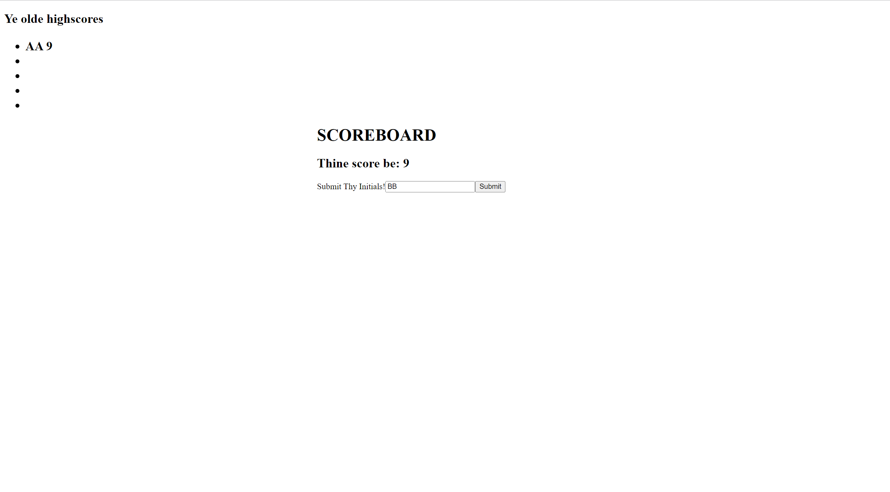

This is a quiz layout dealing with a set interval that decrements everytime a an incorrect answer is given. The time left after the six questions becomes the user's score and the user is then prompted to enter their initials which whill be displayed alongside the corresponding score upon reloading the page.

Deployed site here: https://marlowemich.github.io/codequiz/